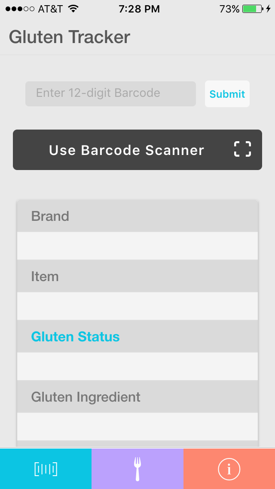
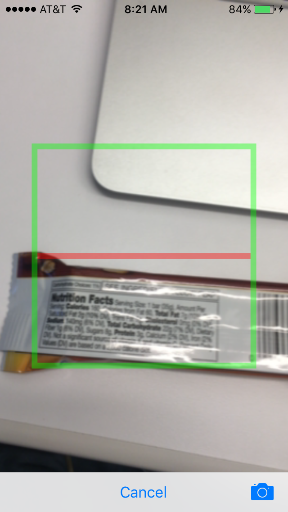
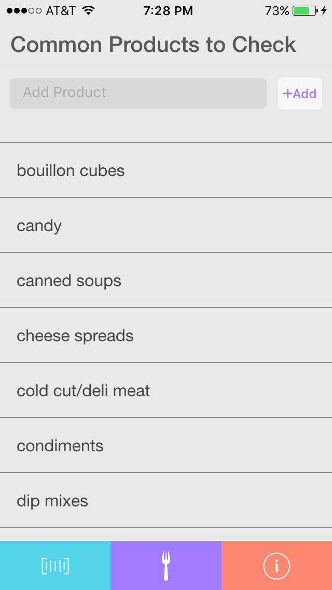
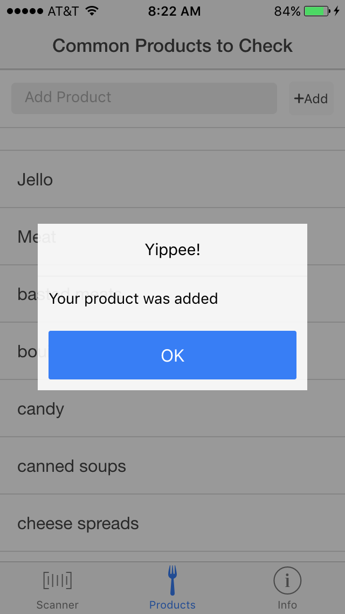
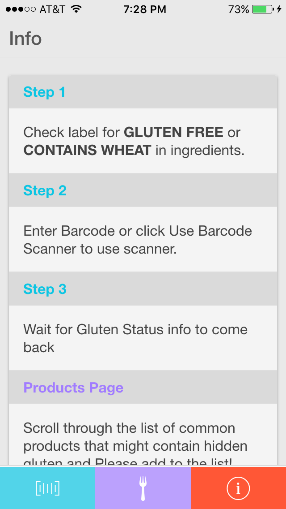

#Gluten Tracker App  

##View Demo
[CLICK HERE](https://www.youtube.com/watch?v=Z96g7eddL9M)

###Overview of the project
Need to avoid gluten? This app allows you to scan a barcode and have a response if it contains gluten or not. The barcode is scanned via the phone camera or typed into the input. An api call is made to retrieve the ingredients and check them against the database of gluten containing ingredients. There is also a product page that contains common products to double check. Add to the list for everyone to be aware. Need more information to use it? Check out the info page. The backend is in a separate repo and is utilized by both the app and the web application. [Web App Repo Here](https://github.com/dkendrick25/gluten_tracker_web_app)

##Technologies Used
* Ionic
* HTML
* CSS
* JavaScript
* Angular.js
* PostgreSQL
* Node.js

##ScreenShots

###Things to Add
* login feature with ability to choose allergy needs
* add to database of products and ingredients
